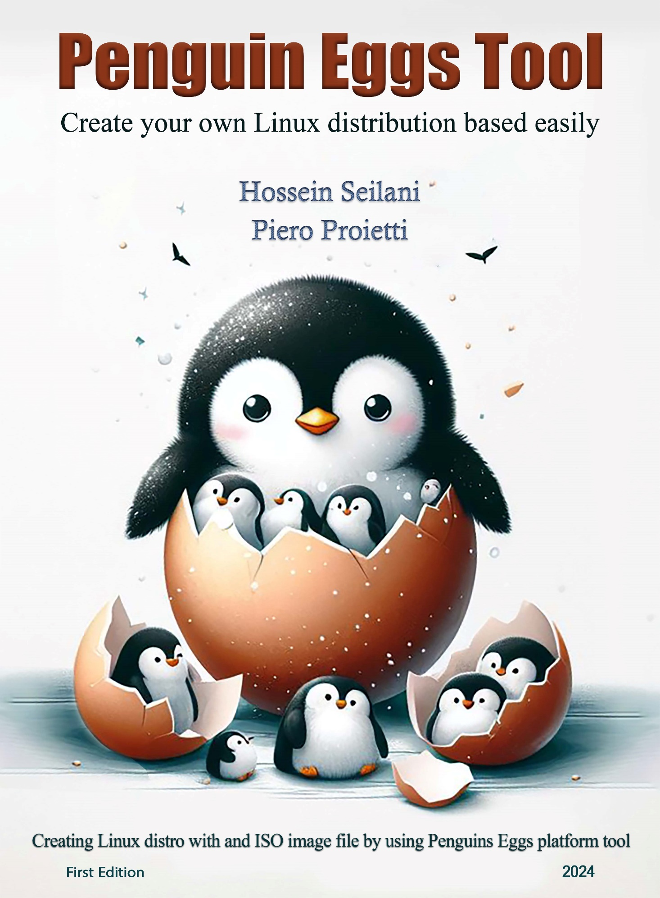

**Penguins' Eggs Tool**

**Create your own Linux distribution based easily**

First Edition

**Hossein Seilani**

**Piero Proietti**

Creating Linux distro with and ISO image file by using Penguins**-**eggs
platform tool

June 2024

# What is the Penguins-eggs book?

This book serves as a comprehensive guide to Penguins' eggs tool,
covering its purpose, installation process in Linux, and the creation of
installable ISO images from your existing Linux system using
Penguins' eggs. Penguins' eggs itself is a dynamic console
tool that empowers users to remaster their operating systems, allowing
for customization distribution as live images via USB sticks or through
PXE. With Penguins' eggs, users gain the ability to tailor their
Linux distributions to their specific needs, making it a valuable
resource for those seeking to create and share their customized Linux
experiences.

**Selected topics included**:

-   Pre-build and concepts

-   Installing Eggs tool

-   Eggs Configurations

-   Producing ISO image file

-   After Producing the ISO file

-   Remastering

-   Privacy and cleaning

-   Testing ISO image file

About the Author

**Hossein Seilani**

**🎓 M.S. in Computer Science**

**About Me:** I am a passionate and versatile professional with a strong
background in computer science. My expertise spans various domains, from
Linux/Windows SysAdmin, UX/UI, Front-End web design, RectJS, SEO,
Graphic Designer.

**Notable Projects:**

1.  **Predator-OS Linux:**

    -   A specialized Linux distribution designed for penetration
        testing, ethical hacking, and privacy.

    -   Contributed to its development and security enhancements.

2.  **Emperor-OS Linux**

    -   An ambitious project focused on creating an all-in-one operating
        system for programming, design, and data science.

    -   Collaborated on feature development and stability improvements.

3.  **Little-Psycho Linux:**

    -   A project centered around destructive and stress testing of
        software and hardware.

    -   Developed tools for overclocking and health testing.

4.  **Hubuntu Linux:**

    -   Hubuntu, short for "Hardened Ubuntu," is a security-focused
        Ubuntu distribution.

    -   Implemented over 800 security controls and comprehensive
        configurations to protect against various attacks.

**My website:** <https://seilany.ir/>

About the Technical Editor

**Piero Proietti**

🌐 **Network Manager \| Programmer \| Administrator**

About Me: I am Piero Proietti with extensive experience in developing
and managing managerial applications, I specialize in serving user bases
ranging from 100 to 500. My journey has been a blend of collaboration,
innovation, and technical progress.

🔧 **Key Highlights:**

\* **Collaboration**: Collaboration for adoption an IT protocol public
source based on Zope and Python, on institutional workflows.
Collaboration for development of products based on JBoss and Oracle
technologies;

\* **Open Source Virtualization**: I started using Proxmox VE from
version 0.7.x, progressively following all versions until the current
one. Over the years, I began to use it as a main workstation as well,
for development by making my own live installable version;

\* **Linux Enthusiast**: Since the beginning of the millennium, I have
been immersed in the Linux ecosystem. Started with Red Hat, to Debian,
then mostly or the others, I now support my own project, Penguins\'
Eggs. This Linux remastering software - built initially with JavaScript,
then switched to TypeScript - allows users to create custom ISO images,
perform backups and clone the system. Whether using Debian, Devuan,
Ubuntu, Arch or their derivatives, Penguins\' Eggs can cover all amd64,
i386 and arm64 architectures.

\* **Dart and JavaScript Enthusiast**: I followed Google\'s Dart project
a lot in its infancy, switching, however, to using the more popular
JavaScript, using it mostly with nodejs: server-side or for system
utility development to facilitate my work as an IT infrastructure
manager.

**Contact me**:

piero.proietti@gmail.com

[[\
]{.underline}](https://ora.ai/profile/symbolic-pink-7h8q)

