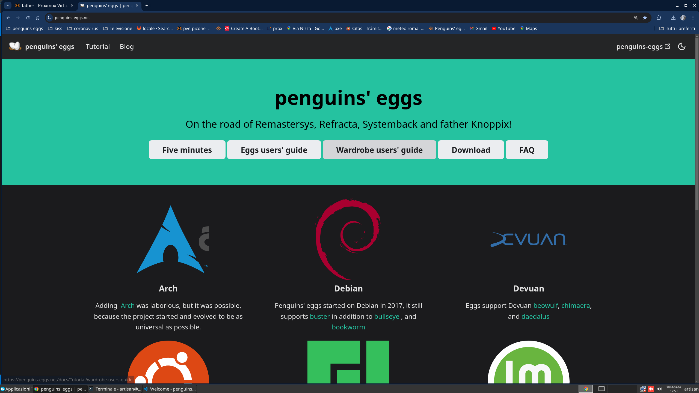

# Chapter 1

# What is penguins' eggs?

eggs stands out as a versatile command-line tool, offering the
capability to transform your existing distro into a redistributable live
ISO image. Notably, the tool also extends its support to Debian/Ubuntu
flavors, making it compatible with variations such as Xubuntu, Kubuntu,
and beyond, in addition to Linux distributions derived from these, such
as Devuan, Linux Mint. 

Upon harnessing the power of Penguins' eggs, users gain the ability to fashion an
installable live ISO embodying their Debian/Devuan/Ubuntu-based, Arch Linux, or 
Manjaro system, complete with all installed applications and personalized
configurations housed within the home folder.

eggs goes beyond creating live ISOs. It allows you to
configure the generated ISO for offline installation, useful for
environments without internet access. 

It also offers a scripting mode for managing ISOs through custom scripts. 

You can even personalize the look and feel of the live CD and Calamares installer with images. This
customization power is driven by [penguins-wardrobe](https:github.com/piero.proietti/penguins-wardrobe), a repository
that provides tools to tailor Linux systems, even for minimal
command-line installations. 

It lets you create customized live ISOs
based on Debian, Ubuntu, and their derivatives. You can even use it to
generate a complete backup of your existing Debian/Ubuntu system,
including user data, all rolled into a bootable ISO. Using Penguins\'
Eggs simplifies these tasks and gives you full control over the content
and distribution of your custom Linux environments. To learn more,
explore the official [Penguins' eggs website](https://penguins-eggs.net) and its community resources

Penguins' eggs takes the complexity out of remastering
Linux systems. It offers a user-friendly interface with powerful
features, making customization and distribution a breeze. The tool works
across various systems based on Debian, Devuan, Ubuntu, Arch Linux, and Manjaro.

This means you can create live ISOs tailored to your specific needs, no
matter your preferred base distro. Penguins' eggs also supports
derivatives of these popular distributions, giving you even more
options. Here's the real benefit: you can not only preserve your
current system setup and applications but also easily share them with
others. 

Penguins' eggs cleverly removes user and system data from the
ISOs it creates. This ensures a clean starting point for new users,
while still allowing you to curate a unique Linux experience for them.

# Why penguins' eggs?

eggs is a versatile tool that offers an array of features
and benefits for Linux users. Whether you want to create an
installable ISO from your current Linux system or explore various
customization options, penguins-eggs has got you covered. To get
started with penguins-eggs, you'll need to install it on your Linux
distribution. The tool supports a wide range of Linux distributions
and their major derivatives, including Arch, Debian, Devuan, Manjaro,
Ubuntu, and more. Additionally, you can easily add support for
additional derivatives, expanding the tool\'s capabilities even
further.

# Top Penguins-eggs features

## fast and efficient

eggs is designed to be fast and efficient. Unlike
traditional methods that involve copying the entire file system,
eggs utilizes livefs, which allows for instant acquisition
of the live system. By default, the tool :

## Supports differents compression algorithm

Employs the compression algorithm, significantly reducing the time
required for the process when creating an installable ISO.

penguins-eggs with its innovative utilization of the `zstd level 3`
compression algorithm as the default, is poised to revolutionize the
realm of Linux distributions by redefining the parameters of speed and
efficiency. This cutting-edge approach to compression stands as
a testament to the relentless pursuit of optimization and performance
enhancements, enabling users to experience unparalleled gains in speed
and responsiveness.

## Supports Clone

penguins-eggs provides various options to suit your needs. With
the `--clone` flag, you can preserve the data and accounts of
yours users, ensuring a seamless experience for users accessing
the live system. Moreover, you can opt for a `--cryptedclone`, where
user data and accounts are saved in an encrypted LUKS volume within the
ISO image, enhancing security and privacy.

penguins-eggs Linux introduces a groundbreaking feature in the form
of `--cryptedclone`, setting a new standard of security and data protection
within the realm of Linux distributions. By default,
penguins-eggs tool empowers users to safeguard their sensitive user
data and accounts by encapsulating them within an encrypted LUKS
(Linux Unified Key Setup) volume, seamlessly integrated within
the ISO image.

## Cuckoo and PXE boot

In addition to ISO creation, penguins-eggs offers a unique feature
called `cuckoo`. By starting `cuckoo` from the live system, you can set
up a PXE boot server, making it accessible to all computers on the
network. This functionality opens up possibilities for network
booting and streamlined deployment. The activation of Cuckoo from
live as the default setting within penguins-eggs heralds a
transformative leap in the domain of Linux distributions, affording
users the ability to harness the unparalleled potential of PXE booting
and network wide deployment with ease.

## Supports Both TUI or GUI Installer

To simplify the installation process, penguins-eggs provides its own
system installer called `krill`. This installer is particularly useful
when a GUI (Graphical User Interface) is not available, allowing
for installation in various situations. However, if you are using a
desktop system, penguins-eggs recommends and configures the
calamares GUI installer, ensuring a seamless and user**-**friendly
experience.

penguins-eggs Linux spearheads a transformative revolution in the realm
of system installation with the incorporation of its TUI
(Text-based User Interface), setting a new standard of versatility and
accessibility within the landscape of Linux distributions. The
integration of these installation mechanisms underscores Penguins Eggs
Linux's unwavering commitment to accommodating diverse user needs
and streamlining installation workflows with unparalleled flexibility
and user-centric design.

## Repository lists

One of the key advantages of penguins-eggs is its commitment to
utilizing only the original distro's packages. This means that no
modifications are made to your repository lists, ensuring a safe and
reliable environment. penguins-eggs prioritizes maintaining the
integrity and authenticity of your Linux distribution.

## Wardrobe

To enhance customization options, penguins-eggs introduces the
concept of Wardrobe. With Wardrobe and its various components, such
as costumes, you can easily organize and manage your customizations,
samples, and more. This feature enables a streamlined and efficient
workflow, allowing you to tailor your Linux system to your
preferences.

## Supporting Multiple Distributions

Eggs supporting multiple distributions and their derivatives.

**Supports**: Arch, Debian, Devuan, Manjaro, Ubuntu and major
derivatives: Linuxmint, KDE neon, EndeavourOS, Garuda, etc. You can
easily add more derivatives.

Arch Linux is a popular Linux distribution known for its simplicity,
flexibility, and rolling release model. Unlike many distros that come
pre-loaded with software, Arch starts with a minimal base system. This
gives you complete control over what is installed, letting you build a
system that perfectly suits your needs. This minimalist approach is
ideal for users who want a clean and efficient system without any
unnecessary extras. Arch\'s popularity has led to the creation of
several derivative distributions, each with its take on the Arch
philosophy. 

Manjaro, for example, is a user-friendly version of Arch
that offers easier installation, pre-configured desktops, and a
graphical package manager for a smoother experience.

Debian derivatives is a godfather in the Linux world. 

This highly respected distro, known for its rock-solid stability, security, and
dedication to free software, has been around since the early days.
However, Debian\'s impact goes beyond its own desktop. It is the
foundation for countless other distributions, including the ever-popular
Ubuntu and its many offshoots. In short, Debian is a major reason why
Linux is so diverse and successful today.

Ubuntu, is a giant in the Linux world, known for being easy to use. It
comes in many flavors, each with a different desktop environment to suit
your taste. The company behind Ubuntu, Canonical, is all about making
Linux user-friendly and stable. They also heavily involve the community
in development. This focus on users has made Ubuntu a favorite among all
kinds of people looking for a polished and versatile Linux experience.

Linux Mint is a popular Linux distro built on top of Ubuntu but with
some key differences. Mint adds its features and a unique desktop
environment, like Cinnamon or MATE, to provide a more polished and
user-friendly experience right out of the box. This focus on user
experience makes Mint a popular choice for people who want a Linux
system that is easy to use and works well without a lot of tinkering.

## Supports hardware architectures

Supports a wide range of hardware architectures.

Supports: i386, amd64 and arm64 architecture, from old PCs, common PCs
to single board computers like Raspberry Pi 4/5.

The i386 architecture, originating from the Intel 80386 microprocessor,
has long been a stalwart in the domain of personal computing.
Initially serving as the cornerstone for many early PCs, the i386
architecture laid the groundwork for the evolution of consumer computing
devices, providing the processing power and framework for the burgeoning
digital revolution.

In parallel to the x86**-**64 architecture, the arm64 architecture
stands as a testament to the dynamism of computing, catering to a
diverse array of devices, ranging from smartphones and tablets to
embedded systems, IoT devices, and single**-**board computers.

## Supports privacy and security 

Safe: Penguins Eggs Linux embarks on a steadfast commitment to user
security and system integrity through its default practice of
exclusively utilizing original distributions' packages without any
modifications in the repository lists.

# More informations
Yuo can fine more information on [CHANGELOG](https://github.com/pieroproietti/penguins-eggs/blob/master/CHANGELOG.md#changelog) 
on the [penguins-eggs repository](https://github.com/pieroproietti/penguins-eggs).

